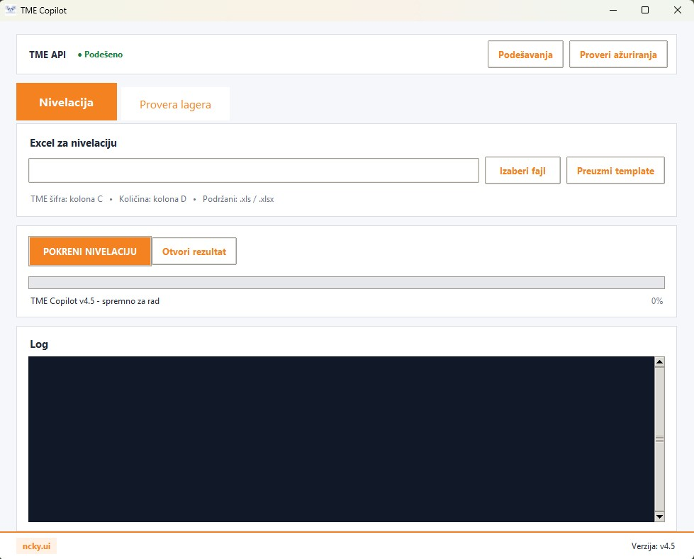
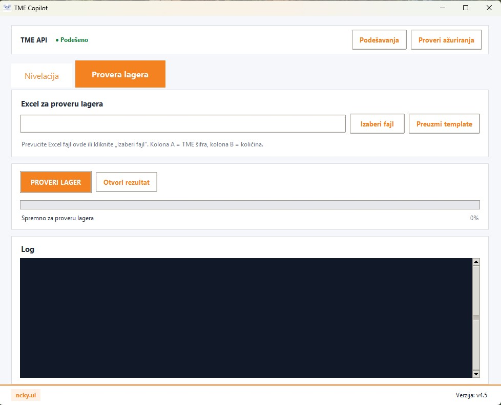
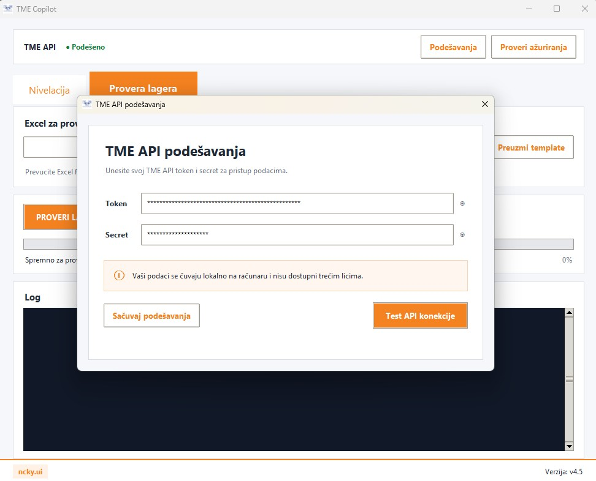

# TME Copilot

Windows application for TME product management and commercial workflows.



## Features

- Product leveling
- TME stock checking
- TME API integration
- Excel import and export
- Price-break calculation based on requested quantity
- Automatic TME API batch processing
- Rate-limit and retry handling
- Excel Drag & Drop
- Excel templates for both workflows
- Windows installer
- Desktop shortcut
- Automatic application updates through GitHub Releases

## Interface

The application provides two main workflows:

- **Nivelacija**
- **Provera lagera**


## Leveling

The leveling workflow uses an Excel file with:

| Column | Name |
|---|---|
| A | Ident |
| B | Naziv |
| C | TME šifra |
| D | Opt. količina |
| E | VP cena |
| F | Zaliha |

The TME part number from column C is used to retrieve product information through the TME API.

### Export formatting

The exported Excel file visually separates data from the imported Excel file and data retrieved from TME.

**Orange** identifies input data:

- Ident
- Naziv
- TME šifra
- Opt. količina
- VP cena
- Zaliha

**Blue** identifies data retrieved from the TME API.

## Stock Check

The stock-check workflow uses:

| Column | Name |
|---|---|
| A | TME šifra |
| B | Opt. količina |

The `Opt. količina` determines which TME price-break is selected.

For example, if TME returns:

| Price break | Price |
|---:|---:|
| 1 | €12.90 |
| 2 | €11.38 |
| 3 | €10.75 |
| 10 | €9.80 |
| 20 | €9.20 |

Then:

- Quantity 20 -> price for 20
- Quantity 17 -> price for 10
- Quantity 3 -> price for 3
- Quantity 1 -> price for 1

The rule is:

**Select the largest price-break that is less than or equal to the requested quantity.**

### Stock Check Export

The result contains:

| Name |
|---|
| TME šifra |
| Količina |
| TME lager |
| JM |
| Cena za traženu količinu |
| Minimalna količina za poručivanje |
| Pakovanja |
| Carinska tarifa |
| Status |
| Cena za 1. kolonu |
| Količina za 1. kolonu |
| Cena za 2. kolonu |
| Količina za 2. kolonu |
| Cena za 3. kolonu |
| Količina za 3. kolonu |

Technical columns that are not normally required by the user are hidden in the exported Excel file and remain available if needed.



## TME API

The application uses the TME API to retrieve product information such as:

- Product information
- Manufacturer
- Manufacturer part number
- EAN
- Description
- Category
- Stock
- Unit of measure
- Pricing
- Price-break quantities
- TME Import Code / customs tariff



### API Credentials

TME API credentials are **not included in the source code, executable, installer or GitHub Releases**.

Each user enters their own:

- API Token
- API Secret

through the application's **Podešavanja** section.

Credentials are stored locally on the user's computer.

This prevents private API credentials from being exposed through the public release repository.

## Excel Templates

Templates can be downloaded directly from the corresponding application tab.

### Leveling Template

```text
Ident | Naziv | TME šifra | Opt. količina | VP cena | Zaliha
```

### Stock Check Template

```text
TME šifra | Opt. količina
```

Supported formats:

```text
.xls
.xlsx
```

## Drag & Drop

Excel files can be dragged directly from Windows Explorer into the application.

- **Nivelacija** active -> file is used for leveling
- **Provera lagera** active -> file is used for stock checking

The regular file-selection button remains available.

## Updates

TME Copilot supports automatic updates through GitHub Releases.

The application can:

- Check for a newer version on startup
- Manually check for updates
- Detect a newer GitHub Release
- Download the latest Windows installer
- Start the installer automatically
- Install the new version

The update process is:

```text
New version built
       ↓
GitHub Release created
       ↓
TME Copilot Setup.exe uploaded
       ↓
Application checks for updates
       ↓
New version detected
       ↓
Installer downloaded
       ↓
New version installed
```

Users do not need to receive a new installer manually for every release.

## Installation

TME Copilot is designed for Windows.

The installer creates:

- Application installation
- Desktop shortcut
- Start Menu shortcut
- Application icon

The installer can remove the previous version before installing a new version.

## Technology

- Python
- Tkinter
- Pandas
- OpenPyXL
- Requests
- TME API
- Windows native Drag & Drop
- PyInstaller
- Inno Setup
- GitHub Releases

## Version

Current release:

**v4.5**

## Release Notes

Detailed changes for each version are maintained in:

```text
PATCH_NOTES.md
```

## Security

Do not commit or publish:

```text
.env
API Token
API Secret
private configuration
customer data
internal business data
```

API credentials should always be entered locally by the user.

## License

This project is intended for authorized use with valid TME API credentials.

TME API access and usage are subject to the applicable TME API terms and conditions.

## Author

**ncky.ui**
